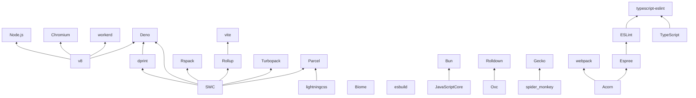

2024-09-03

## Engine

- [V8](https://v8.dev/)
  - JavaScript engine
- [JavaScriptCore](https://docs.webkit.org/Deep%20Dive/JSC/JavaScriptCore.html)
  - JavaScript engine
- [SpiderMonkey](https://spidermonkey.dev/)
  - JavaScript engine

## Parser

- [SWC](https://swc.rs/)
  - JavaScript parser
- [Oxc](https://oxc.rs/)
  - JavaScript parser
- [Lightning CSS](https://lightningcss.dev/)
  - CSS parser
- [Acorn](https://github.com/acornjs/acorn)
  - JavaScript parser
- [Espree](https://www.npmjs.com/package/espree)
  - JavaScript parser

## Bundler

- [Rollup](https://rollupjs.org/)
  - JavaScript bundler
- [Rolldown](https://rolldown.rs/)
  - JavaScript bundler
- [esbuild](https://esbuild.github.io/)
  - JavaScript bundler
- [Rspack](https://rspack.dev/)
  - JavaScript bundler
- [Parcel](https://parceljs.org/)
  - JavaScript bundler
- [Turbopack](https://turbo.build/pack/docs)
  - JavaScript bundler
- [webpack](https://webpack.js.org/)
  - JavaScript bundler

## Formatter

- [dprint](https://dprint.dev/)
  - JavaScript formatter
- [Biome](https://biomejs.dev/)
  - JavaScript formatter

## Linter

- [ESLint](https://eslint.org/)
  - JavaScript linter
- [typescript-eslint](https://typescript-eslint.io/)
  - TypeScript linter

## Runtime

- [Deno](https://deno.com/)
  - JavaScript runtime
- [Bun](https://bun.sh/)
  - JavaScript runtime
- [workerd](https://github.com/cloudflare/workerd)
  - JavaScript runtime

## Browser

- [Chromium](https://www.chromium.org/Home/)
  - Browser
- [Gecko](https://firefox-source-docs.mozilla.org/overview/gecko.html)
